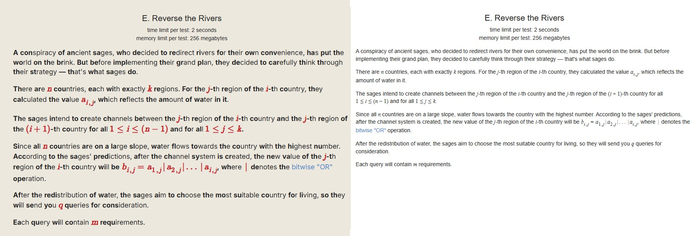

# Codeforces Easy Reader Chrome Extension

A Chrome extension that enhances the reading experience in Codeforces using a custom bionic reading method.

## Features

- Makes the first few letters of each word bold
- Makes the math equations red
- Changes the font to Inter

## Installation

1. Clone the repository
2. Open Chrome and go to [chrome://extensions](chrome://extensions)
3. Enable **developer mode**
4. Click on **Load unpacked** and select the cloned repository

## Usage

- Go to a Codeforces problem page e.g. [2036/E](https://codeforces.com/problemset/problem/2036/E)
- Click on the extension icon in the top right corner and select **on/off**
